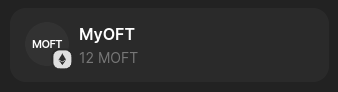

Solana -> Sepolia
View Solana transaction here: https://explorer.solana.com/tx/3onTKJxjVNvc7PWxGyYYgxYfXxxc9Jz686ZrTjCUTtXJZtpDE659o9xw2CfhLnHysY8sG9jvbwX5fG2cjCscdWPk?cluster=devnet
Track cross-chain transfer here: https://testnet.layerzeroscan.com/tx/3onTKJxjVNvc7PWxGyYYgxYfXxxc9Jz686ZrTjCUTtXJZtpDE659o9xw2CfhLnHysY8sG9jvbwX5fG2cjCscdWPk

Sepolia -> Solana
send: 2000000000000000000 to BQHXVMJo4zGSnLdFRrDnfjajqVuyCPEjRBbvxm62zaJU: 0x460bb12193bbfaeab1f1fe5232bfeb9d44b3e1ed702d27b644fa7530eed7b9df
Track cross-chain transfer here: https://testnet.layerzeroscan.com/tx/0x460bb12193bbfaeab1f1fe5232bfeb9d44b3e1ed702d27b644fa7530eed7b9df